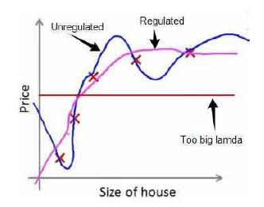

## 第七章－正则化（Regularization）

### 7.1 过拟合问题
如下回归列子

同样分类问题：

对于多项式，ｘ的次数越高，拟合的效果越好，但相应的预测能力可能变差。
*处理方式:*
- 降维处理，丢弃一些不能帮助我们正确预测的特征。手工选择或某些算法如PCA
- 正则化。保留所有的特征，但是减小参数的大小（magnitude）
### 7.2 代价函数
加入正则化后的代价函数：

### 正则化线性回归

正则化线性回归的梯度下降算法每次都在原有算法的更新规则上令theta的值减少了一个额外的值
(这样不是等价于减小学习率？？)