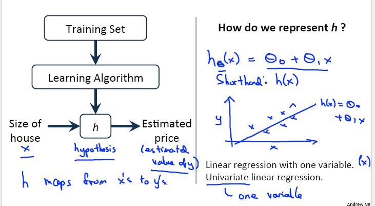
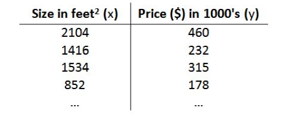
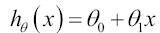
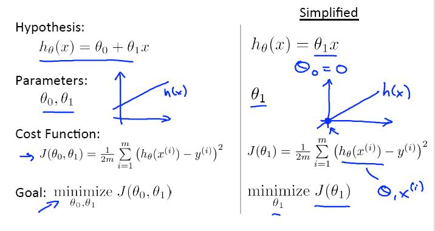
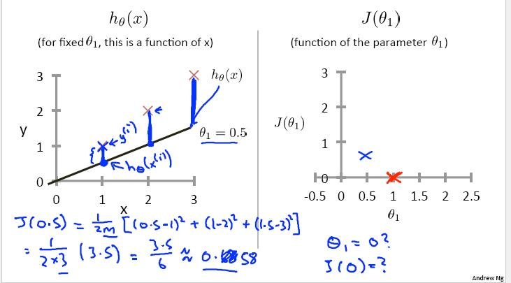
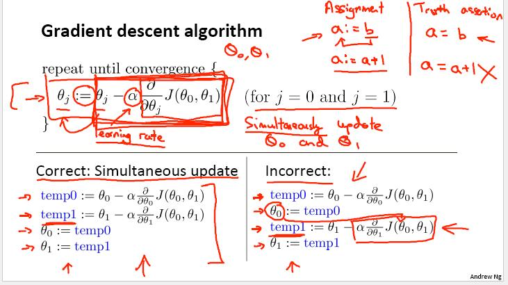
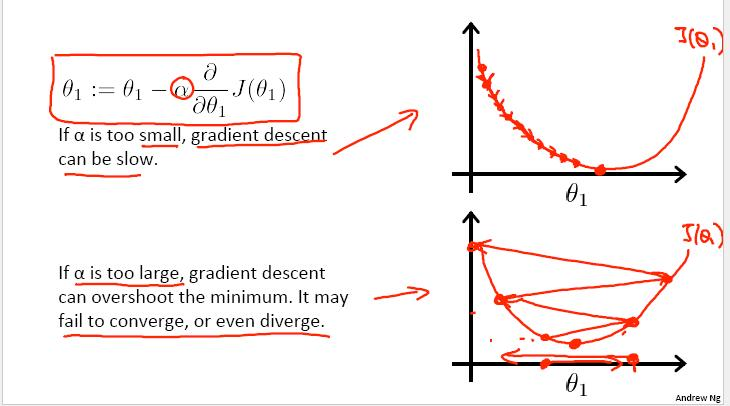

## 2-1 模型表示 Model Representation 
### 监督学习算法工作方式

###
对于房屋交易问题，假使我们回归问题的训练集(Training Set) 如下表示：

一种可能的表达式为： 因为只含有一个特征/输入变量，因此这样的
问题叫做单变量线性回归问题

## 2-2 代价函数（cost-function）

通过有效的算法，获得参数使得代价函数最小化

## 2-5 梯度下降

*学习率对梯度下降的影响：*

