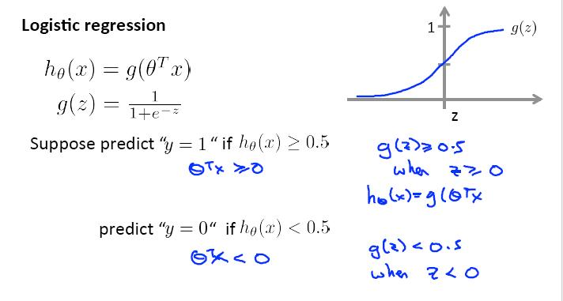
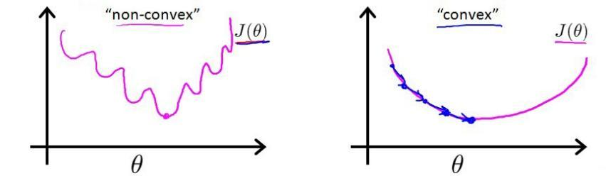
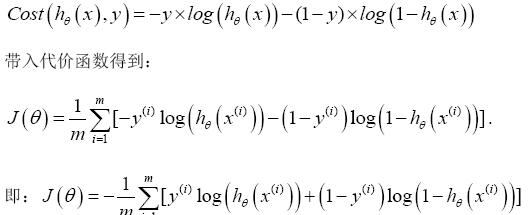
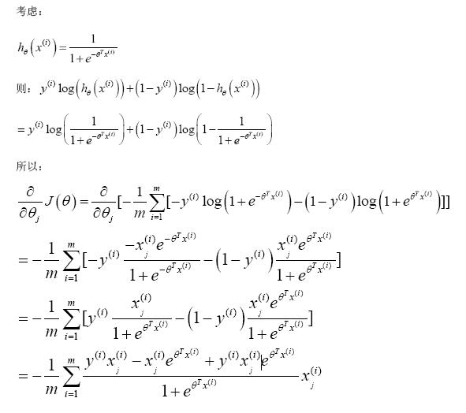
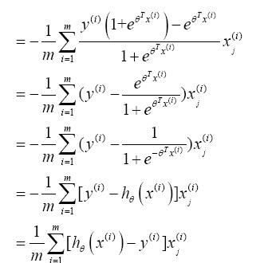
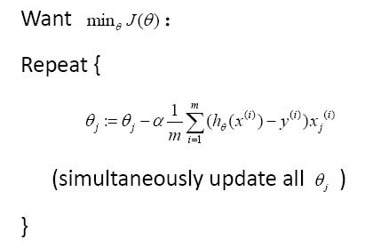
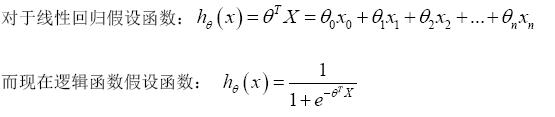

## 第六章－逻辑回归（Logistic Regression）

### 6.1 逻辑回归表达式

### 6.2 代价函数（cost function）

对于线性回归模型，我们定义的代价函数式所有模型误差的平方和。但对于逻辑回归，若使用该代价函数，我们得到的将是一个非凸函数（non-convex function）

逻辑回归代价函数

逻辑回归的梯度推导：

得到梯度下降算法：

该公式与线性回归的跟新公式式一致的，但ｈ的表达式式不同的。

