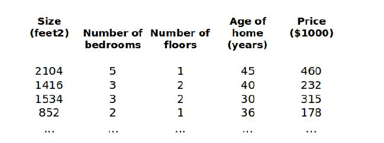
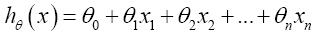
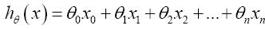
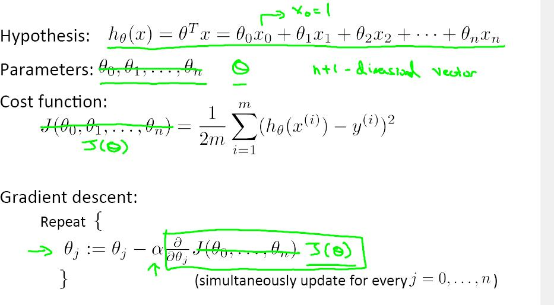
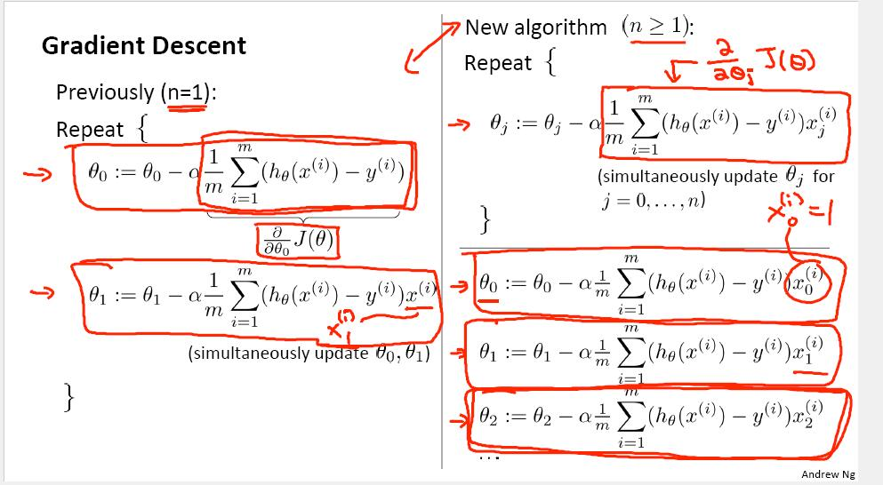
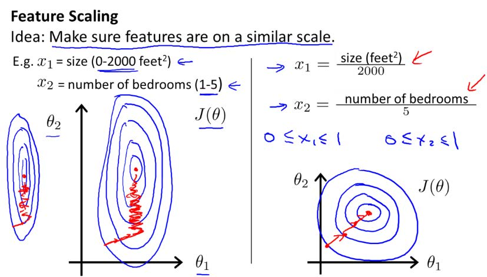
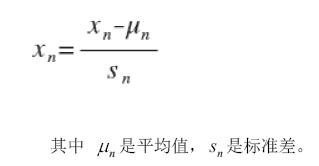

## 第四章－Linear Regression with Multiple Variables

### 4.1
对于房屋问题，我们引入多个变量

则支持多变量的假设ｈ表示为：

引入x０=1则公式简化为：
此时模型参数是一个n+1维的向量。

### 4.2 多变量梯度下降（Gradient Descent for Multiple Variables）

梯度下降算法：

### 4.3 Gradient Descent in practice I - Feature Scaling(特征缩放)
将特征缩放到相同尺度，有助于加快梯度下降算法的收敛

#### Learning Rate(学习率)
梯度下降算法的每次迭代受到学习率的影响，如果学习率过下，则达到收敛的迭代次数则会增加，如果学习率过大，每次迭代可能不会减小代价函数，可能会越过局部最小值导致无法收敛。

## 4.5 特征和多项式回归（Feature and polynomial regression）
创造更多有效的特征，有助于模型更加准确，但也可能造成过拟合问题